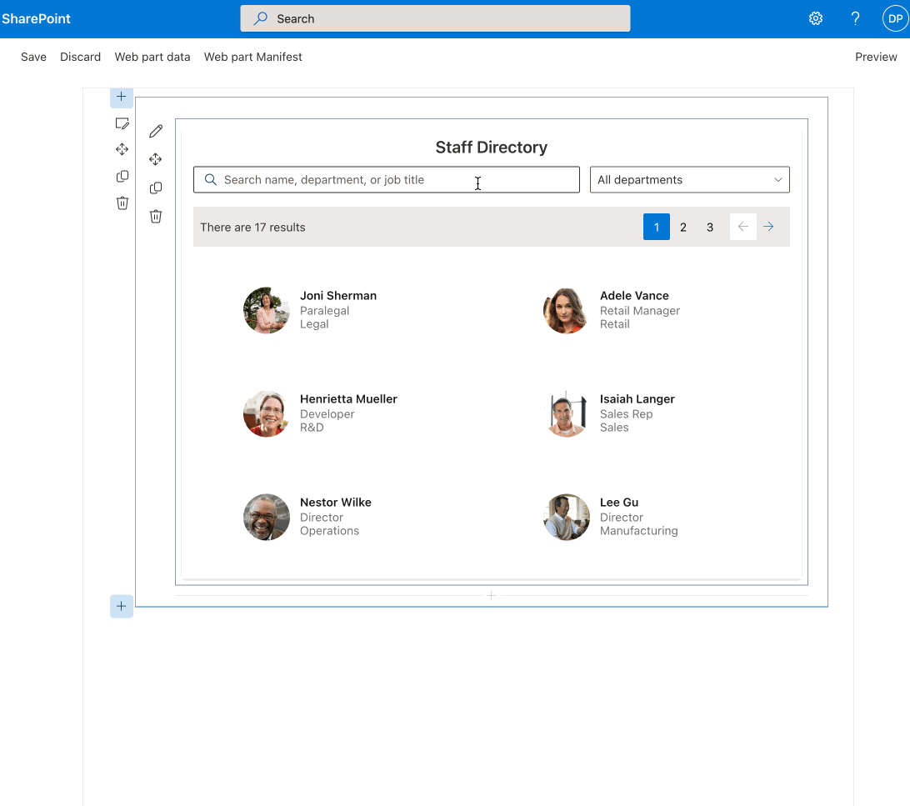

# spfx-staff-directory

## Summary

SharePoint Framework web part to search the company tenant via the Graph API. Has the ability to filter by Microsoft 365 groups and departments.



## Used SharePoint Framework Version


## Applies to

- [SharePoint Framework](https://aka.ms/spfx)
- [Microsoft 365 tenant](https://docs.microsoft.com/en-us/sharepoint/dev/spfx/set-up-your-developer-tenant)

> Get your own free development tenant by subscribing to [Microsoft 365 developer program](http://aka.ms/o365devprogram)

## Prerequisites

> This solution uses Yarn as a package manager. Delete yarn.lock before using npm.

> Requires Microsoft Graph API permissions for User.ReadBasic.All (to read the directory) and Chat.Create to initiate a chat via the user popup. Grant these permissions in the SharePoint Admin Center.

> This solution uses Microsoft Graph Toolkit v3. You must install the [sppkg package from Microsoft](https://github.com/microsoftgraph/microsoft-graph-toolkit/releases/tag/v3.1.0) before installing this app.

## Solution

| Solution    | Author(s)                                               |
| ----------- | ------------------------------------------------------- |
| /sharepoint/solution/spfx-staff-directory.sppkg | [MRS Company Ltd](https://mrscompany.com) |

## Version history

| Version | Date             | Comments        |
| ------- | ---------------- | --------------- |
| 1.0     | July 17, 2023 | Initial release |

## Disclaimer

**THIS CODE IS PROVIDED _AS IS_ WITHOUT WARRANTY OF ANY KIND, EITHER EXPRESS OR IMPLIED, INCLUDING ANY IMPLIED WARRANTIES OF FITNESS FOR A PARTICULAR PURPOSE, MERCHANTABILITY, OR NON-INFRINGEMENT.**

---

## Minimal Path to Awesome

Clone and go to repository:

```bash
git clone https://github.com/MRSCompanyLtd/spfx-staff-directory
cd spfx-staff-directory
```

Add your development tenant URL to /config/serve.json.

Run development:

```bash
yarn dev # runs gulp serve
```

Package to deploy:

```bash
yarn package # runs build, bundle, and package-solution
```

Upload ./sharepoint/solution/*.sppkg to app catalog.

## Features

This is a full-featured staff directory web part, including:

- Search by text for name, job title, or department.
- Filter by a Microsoft 365 group, such as "All Staff" group for active users.
- Optional department filter.
- Customizable paged results.

This web part uses:

- Microsoft Graph API - fetching users and photos
- Batching Graph API calls
- Use of Microsoft Graph Toolkit
